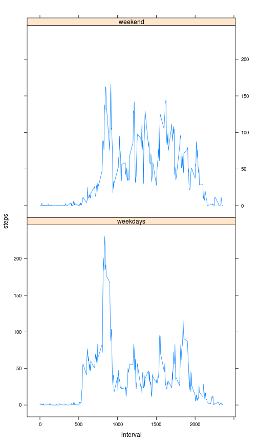

# Reproducible Research: Peer Assessment 1


## Loading and preprocessing the data
Unzip and assign the csv data. 

```r
data <- read.csv(unz("activity.zip", "activity.csv"))
```

## What is mean total number of steps taken per day?
Calculate the daily sums of steps first. Then get mean and median. We need to ignore NA values to run these functions.

```r
sums <- tapply(data$steps,data$date,FUN=sum)
meanSteps <- mean(sums[!is.na(sums)])
medianSteps <- median(sums[!is.na(sums)])
```
Create the histogram

```r
hist(sums,xlab="steps",main="steps per day")
```

 

Mean: 1.0766 &times; 10<sup>4</sup>  
Median: 10765

## What is the average daily activity pattern?
Create a new data set ignoring the NA values. Then sum the steps for each interval and find the interval with maximum sum.

```r
data2 <- data[!is.na(data),]
dpattern <- tapply(data2$steps,data2$interval,FUN=sum)
maxInterval <- names(dpattern)[which(as.numeric(dpattern) == max(as.numeric(dpattern)))]
```

Create the plot

```r
plot(as.numeric(names(dpattern)),as.numeric(dpattern),type="l",xlab="interval",ylab="steps",main="Average steps per interval")
```

 

Interval with  maximum number of steps: 835.
## Imputing missing values
Calculate missing steps

```r
missing <- nrow(data[is.na(data$steps),])
```

Missing: 2304  

Create a new data set and replace NA values with interval mean value. Then calculate sums as above for the original data set.

```r
dataReplaced <- data
for (i in which(is.na(dataReplaced$steps))) {
    dataReplaced[i,1] <- mean(dataReplaced[dataReplaced$interval == dataReplaced[i,3] & ! is.na(dataReplaced$steps),1])
}
sumsReplaced <- tapply(dataReplaced$steps,dataReplaced$date,FUN=sum)
meanStepsReplaced <- mean(sumsReplaced)
medianStepsReplaced <- median(sumsReplaced)  
```

Create the histogram

```r
hist(sumsReplaced,xlab="steps",main="steps per day")
```

 

Mean: 1.0766 &times; 10<sup>4</sup>  
Median: 1.0766 &times; 10<sup>4</sup>

We can observe a small change in the median.

## Are there differences in activity patterns between weekdays and weekends?
Parse the date fields as Dates first. Then create a field for weekday/weekend. Then separate the data for weekdays and weekends  calculate means, and finally put it together again.

```r
dataReplaced$date <- as.Date(dataReplaced$date)
dataReplaced$day <- "weekday"
dataReplaced$day[weekdays(dataReplaced$date) == 'Sunday' | weekdays(dataReplaced$date) == 'Saturday'] <- "weekend"
weekdays <- dataReplaced[dataReplaced$day == "weekday",]
weekend <- dataReplaced[dataReplaced$day == "weekend",]
weekdays <- tapply(weekdays$steps,weekdays$interval,FUN=mean)
weekend <- tapply(weekend$steps,weekend$interval,FUN=mean)
we <- as.data.frame(names(weekend))
wd <- as.data.frame(names(weekdays))
we$steps <- as.numeric(weekend)
wd$steps <- as.numeric(weekdays)
we$day <- "weekend"
wd$day <- "weekdays"
we <- as.data.frame(we)
colnames(we)[1] <- "interval"
wd <- as.data.frame(wd)
colnames(wd)[1] <- "interval"
days <- rbind(we,wd)
days$interval <- as.numeric(as.character(days$interval))
days$steps <- as.numeric(as.character(days$steps))
```
Plot weekdays and weekends

```r
library("lattice")
xyplot(steps ~ interval | day,data=days,type="l",layout=c(1,2))
```

 
